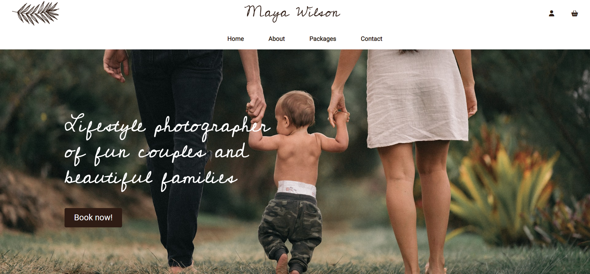
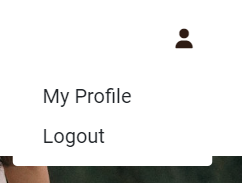
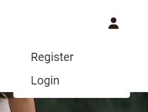
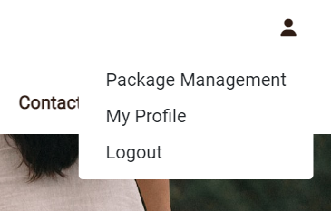

# Maya Wilson Photography

Welcome to Maya Wilson Photography!
Users can browse and purchase the different photography packages and make an enquiry. They can also learn more about the photographer.

The payment system uses Stripe. Please note that this website is for educational purposes do not enter any personal credit/debit card details when using the site.

To test this system, test card details can be used. A list of these can be found in Stripe's documentation [here](https://stripe.com/docs/testing#cards).

The live link can be found here - [Maya Wilson](https://mayawilson.herokuapp.com/)

## Site Owner Goals

- To provide  information about the available photo packages.
- To promote herself as a photographer.
- To encourage users to create an account.
- To encourage users to buy photo sessions.
- To present the user with a website that is responsive and easy to use.

## User stories

As a first-time user:

-	I want to understand the main purpose of the website easily
-	I want to be able to navigate throughout the site.
-	I want to enjoy nice and clean design and style that is inline with the subject of the site.
-	I want to learn more about the photographer and her story
-	I want to view a list of the available photo packages
-	I want to view individual package details
-	I want to easily register for an account, if I want to return later

As a registered user:

-	I want to easily login or logout
-	I want to easily recover my password in case I forget it
-	I want to receive an email confirmation after registering
-	I want to have my own user profile
-	I want to be able to add a photo package to my shopping bag
-	I want to easily select a date for my photography session when purchasing it
-	I want to view the package in my bag
-	I want to easily enter payment information
-	I want to feel my personal and payment information is safe and secure
-	I want to view an order confirmation after checkout
-	I want to see my order history in my profile

As an admin:

-	I want to be able to add a new photography package
-	I want to edit/update a package
-	I want to delete a package

User stories not yet implemented:
-   As a first-time user, I want to find the photographer's whole portfolio on the site.
-   As a registered user, I would like to be able to leave reviews.

## UX

### Fonts

- I have used Google Fonts to find the font that suits best to the feel of the website. I have used [Cedarville Cursive](https://fonts.google.com/specimen/Cedarville+Cursive) for the logo and the main titles and [Roboto](https://fonts.google.com/specimen/Roboto) for the page contents.

### Icons

- The icons on the website were taken from [FontAwesome](https://fontawesome.com/).

### Colors

- The main colours on the website are brown, white, and dark green. This is because I wanted a simple, clean design with natural colours.

### Wireframes

Hand-drawn wireframes.

<b>Wireframes</b> (click to expand)

- [Home Page]()
- [Login Page]()
- [Registration Page]()
- [About Page]()
- [Contact Page]()
- [Packages Page]()
- [Package Details Page]()
- [Checkout Page]()
- [Profile Page]()

## Features

### Existing Features

#### Design

    - A clean and simple design and layout with consistency throughout.
    - Responsive design allowing users to use site across all devices.

#### Header
    1. Navbar
    - Easy navigation by using the navigation bar. Nav links are clearly idenfied both on desktop and when sidenav is expanded on smaller the devices.

    2. Logo
    - The leaf logo is positioned in the top left of the header and is linked to the home pagefor help the navigation of the users.

    3. User icon
    - The User icon is a drop down menu which includes the Sign up and Log in links. Once a user is logged in, the options will change to My Profile and Logout. If the user is superuser Package Management becomes available in the dropdown menu.

    4. Bag icon
    - It is on the right side of the header next to the user icon. Once a package is added to the basket a number displaying the total price appears, and the colour changes into green.
    Once a product is added to the bag, a number displaying the total quantity of items appears, located at the top right of the bag icon. Clicking the bag icon navigates the user to the checkout page which displays the added package and the checkout form.

#### Home page

    - The home page includes a call to action button which encourages the user to 'Book now'.

#### About page

    - The About page includes a little introduction from the photographer and two photos of her portfolio.

#### Packages page

    - Each package card shows an image, its name and price.
    - If the user is a superuser, edit and delete buttons will appear at the bottom of the card.
    - If the user clicks on the card it will take them to the package details page.

#### Package details page

    - The package details page displays the image, name, price, package details details like photos included, duration time and a short description.
    - If the user is a superuser, edit and delete buttons will appear.
    - If the user is logged in a date input field and a disabled quantity field will appear along with the Book this package button.

#### Package Management

    1. Add package
    - The add package page can be accessed by clicking the 'Package Management' button in the user dropdown meneu and is only visible to superusers.
    - If a user tries to add a product without being a superuser they are redirected to the home page.
    - The user must fill out all the fields that have an Asterix. If the form is submitted with any of these fields left blank or with just whitespace then an error message will appear above that particular field, notifying the user of the issue.
    - The user can add a photo if they wish. If they choose not to, a default image displays as their package image.
    - Clicking the 'Add Package' button at the bottom of the form will create the package.
    - The user will receive a success message notifying them that the product has been successfully added.

    2. Edit a package
    - The superuser can edit a Package by clicking the edit button on the package card or on the package detail page.
    - The form opens with all fields populated with the original content.
    - If a user tries to add a package without being a superuser they are redirected to the home page.
    - Clicking the 'Update Package' button at the bottom of the form will update the package with the changes.
    - The superuser will receive a success message notifying them that the package has been successfully updated.

    3. Delete a package
    - The superuser can choose to delete a package by clicking the delete button on the package card or on the package detail page.
    - The superuser will receive a success message notifying them that the package has been successfully deleted.

#### Contact page

    - A user can open up the contact form by clicking on the "Contact" button in the navbar.
    - The user must fill out all the fields that have an Asterix. If the form is submitted with any of these fields left blank or with just whitespace then an error message will appear above that particular field, notifying the user of the issue.
    - When the form is submitted, the user is taken to the confirmation page.

#### Login, logout

    - Users of the site can create an account and verify their email address. (Link emailed to the address they provided)
    - Users can login into their existing account.
    - Users can logout of their account.
    - Users can reset their password if they forget it.
    - Success messages inform the user if they have logged in/logged out successfully.

#### My profile

    - Logged in users have access to their profile, where they can view their order history.

#### Checkout

    - The user can fill out a form with their contact details, address and card number.
    - The user must fill out all the fields that have an Asterix. If the form is submitted with any of these fields left blank or with just whitespace then an error message will appear above that particular field, notifying the user of the issue.
    - The user can see a summary of their purchase, the package name, the booked date and the total price.
    - Clicking the package image in the summary will take the user to that product's detail page.

    - The card payment is handled by Stripe to ensure secure payment.
    - Incorrect card numbers will automatically show an invalid card number error.
    - A loading screen will appear when a payment is being processed to stop the user clicking away.
    - There is a warning message at the bottom of the page informing the user of how much their card is about to be charged.
    - When the form is submitted, the user is taken to the confirmation page.

### Defensive Programming

To protect the site and defend against any "brute force", I added some defensive programming:
-   Where I have used function based views I have used Django's login_required decorator to restrict access as required. 
-   Check if a user is logged in. This checks if tuser is logged in, if so allows the user to perform the action. If not will redirect user to the appropriate page.
-   Check if user is superuser (is admin). The admin is the only one who can add, edit and delete packages. If the check fails, the user is redirected and a message displayed.
-   Certain action buttons are only displayed to certain users, for example 'Package management' is only displayed to superusers. Only logged in user can add any package to their basket.
-   If incorrect or empty data is added to a form, the form won't submit and a warning will appear to the user informing them what field raised the error.
-   The database url and secret key are stored in the env.py file to prevent unwanted connections to the database. Stripe keys are also stored in the env.py file. 
-   Cross-Site Request Forgery (CSRF) tokens were used on all forms throughout this site.

### Features left to implement

- An option for newsletter signup.
- Users to have ability to delete their account.
- A portfolio page.
- Users to have ability to leave reviews.
- Enquiries dashboard for the superusers.

## Structure of the site

The structure of the site has been developed to enable users to access and use the site with ease.
- Home Page- accessible by all users, whether logged in or not. 
- Navbar - is accessible to all users. The navbar changes to a sidenav on tablet screens and smaller for responsiveness. The options available under the account icon change depending on whether a user is logged in or not.

    * For logged in users:  

    * For not logged in users:  

    * For admin:  

- The About page is accessible to all users, whether logged in or not.
- The Contact page is accessible to all users, whether logged in or not.
- List of packages and the details of the packages are accessible to all users, whether logged in or not.
- Book this package button and the Checkout page are only accessible to registered users.
- Edit and delete package buttons are only accessible to superusers.ir order history.
- Checkout page is only accessible to logged in users once they have a package in their basket.

## Technologies used

### Languages

### Frameworks, Tools and Libraries

## Testing

To view all testing documentation please refer to [TESTING.md](TESTING.md).

## Deployment

## Credits

### Media

| Media  | Photographer  | Link |
| :------------ |:---------------:| -----:|
| Background image |  |  |

### Resources used

I used the [Code Institute](https://codeinstitute.net/) lessons as an inspiration for this project.

### Setup and text in README.md

I have used my own README.md file from MS3 as inspiration for this README.md.

## Acknowledgments

My mentor Tim for his support, advice and feedback.