# Testing 

## Validator Testing

### HTML Validation
All HTML pages were tested using [W3C Markup Validation](https://validator.w3.org/). 

<b>HTML validation images below</b> (click to expand)

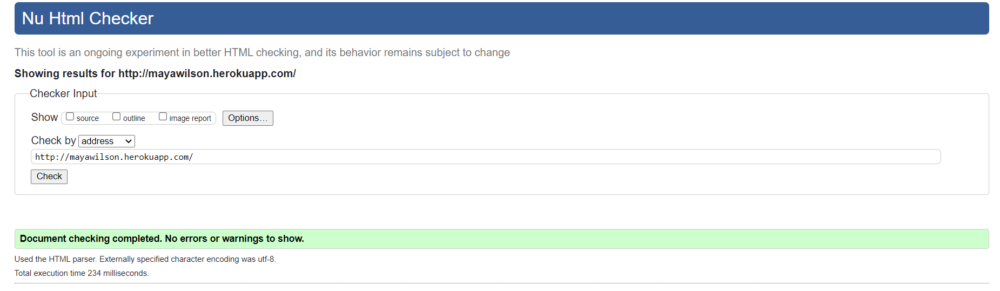
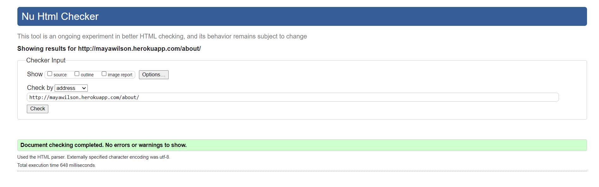
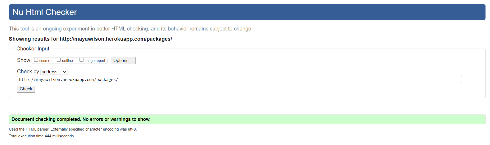
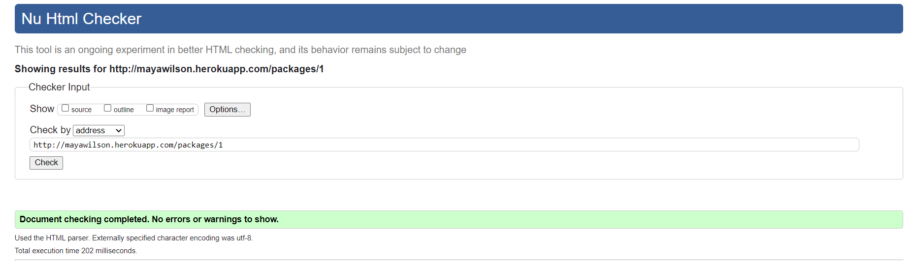
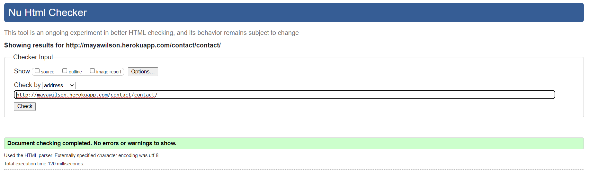
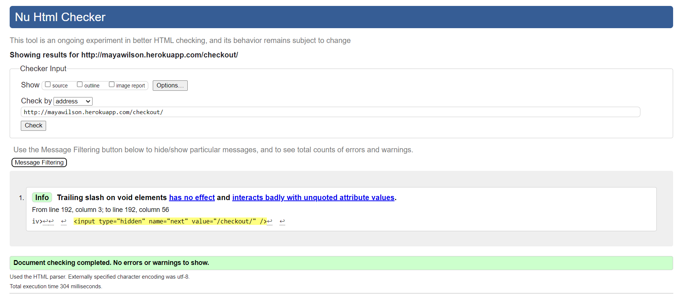
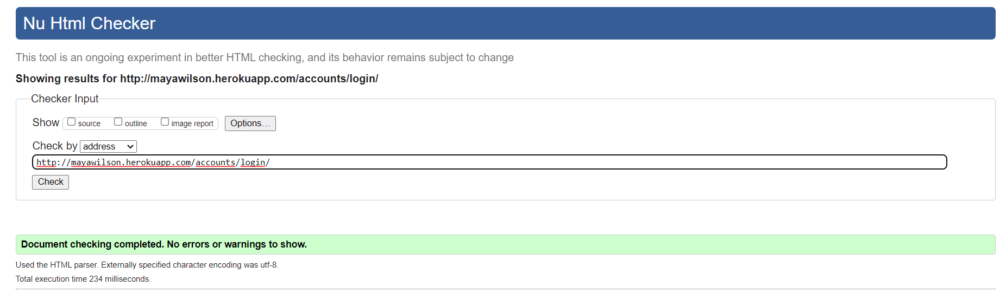
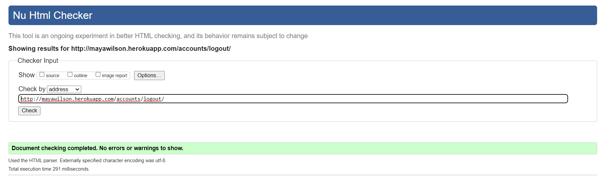
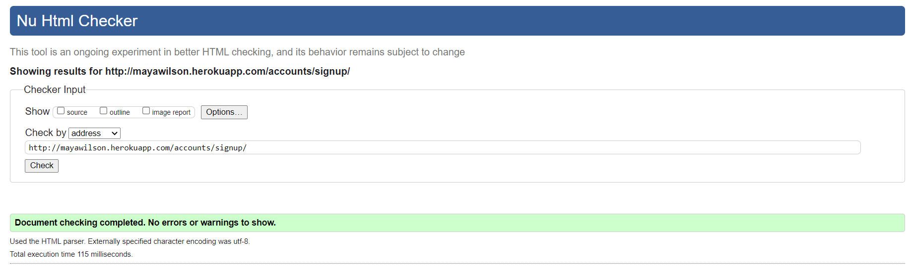
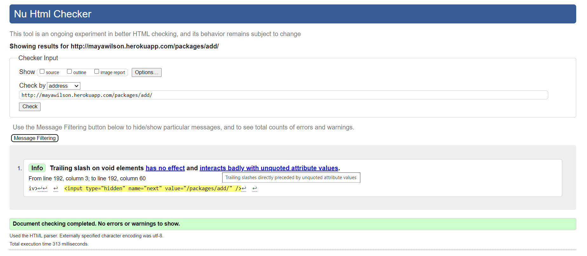

### CSS Validation
The [W3C CSS Validator](https://jigsaw.w3.org/css-validator/) was used to test the style.css file. No changes were required.

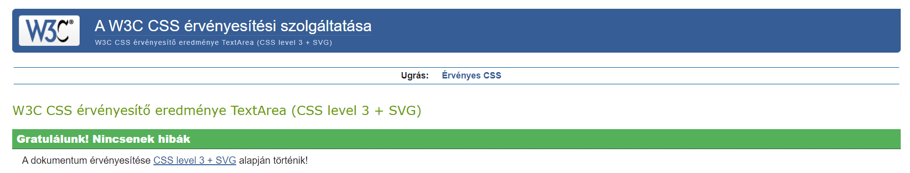
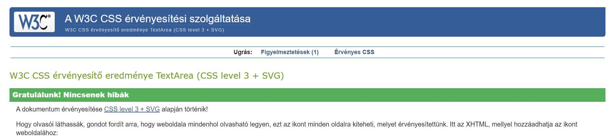

### JavaScript Validation
[JSHint Validator](https://jshint.com/) was used to validate all JavaScript files. 

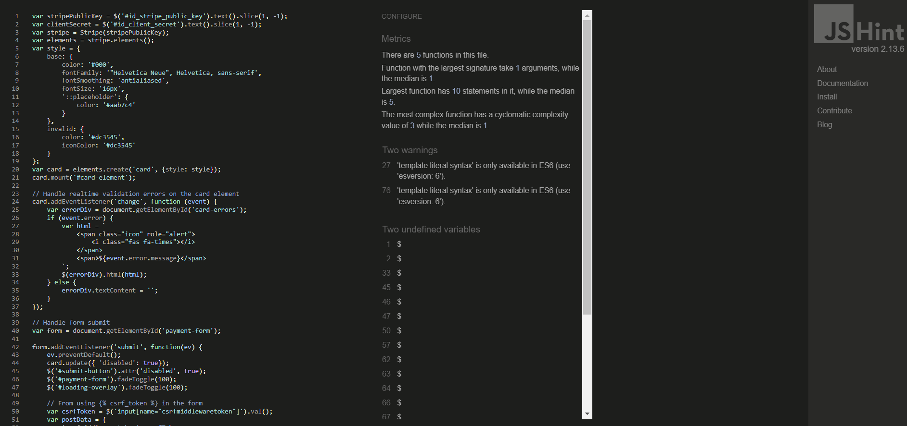

### Python Validation
Flake8 was used to test the Python files in the project.

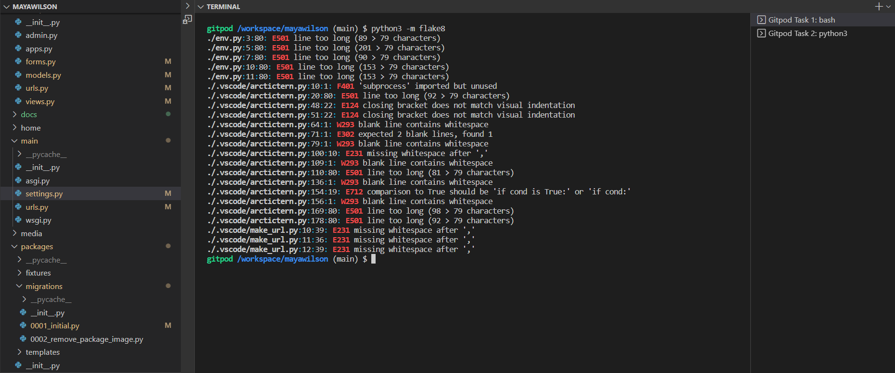

