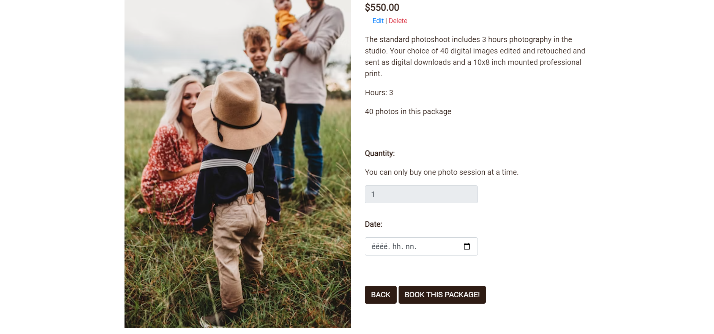
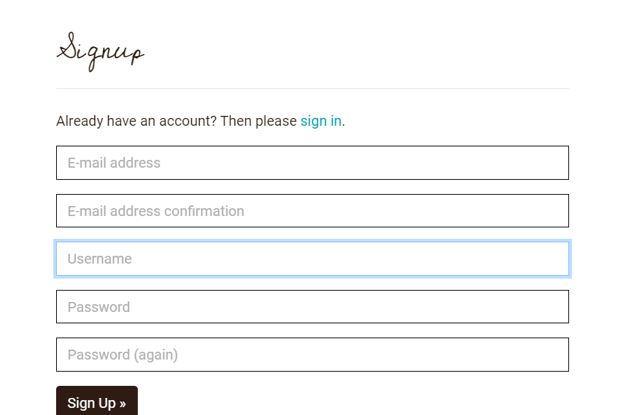
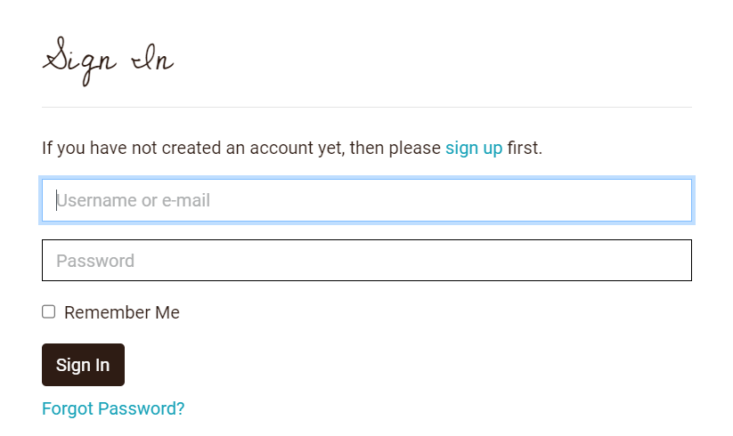
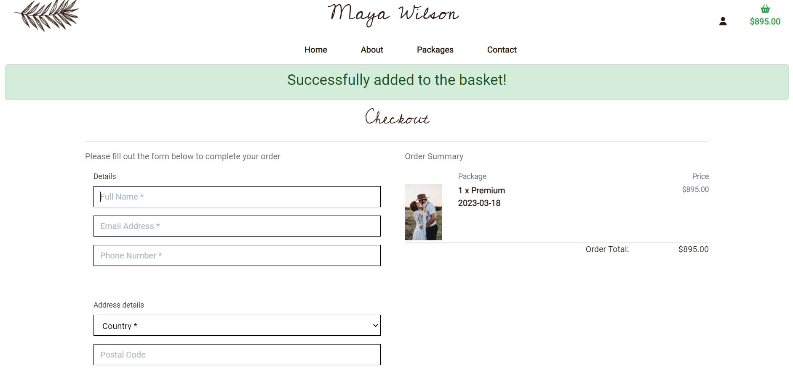
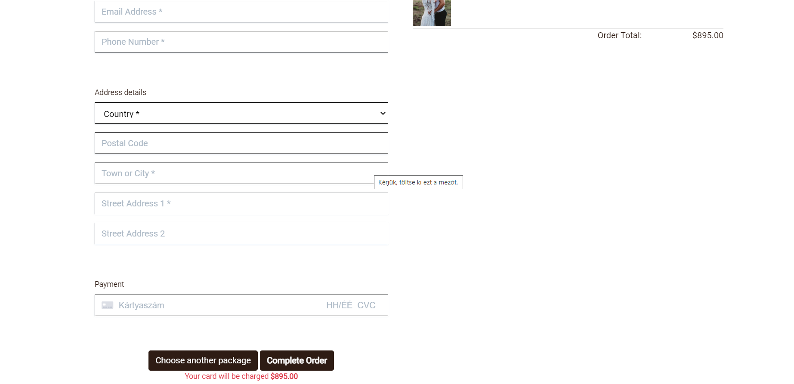
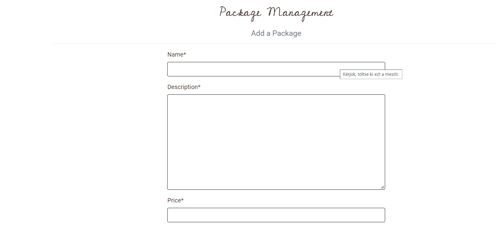
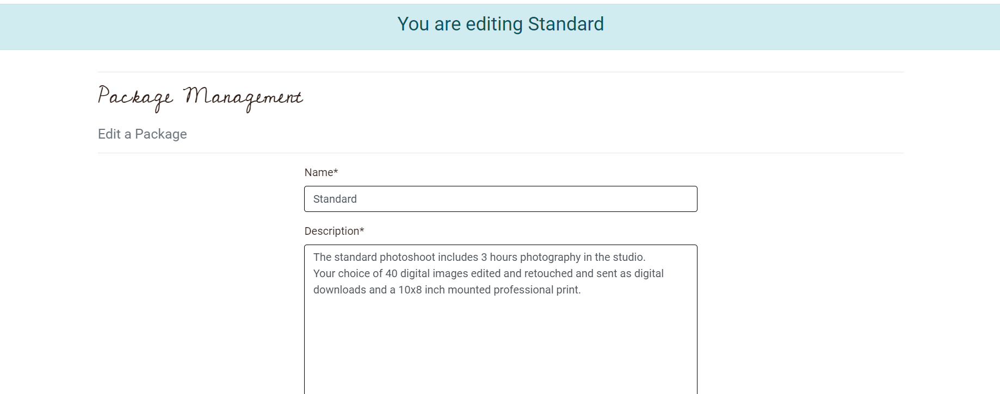

# Testing 

## Validator Testing

### HTML Validation
All HTML pages were tested using [W3C Markup Validation](https://validator.w3.org/). 

<b>HTML validation images below</b> (click to expand)

### CSS Validation
The [W3C CSS Validator](https://jigsaw.w3.org/css-validator/) was used to test the style.css file. No changes were required.

### JavaScript Validation
[JSHint Validator](https://jshint.com/) was used to validate all JavaScript files. 

### Python Validation
Flake8 was used to test the Python files in the project.

### Accessibility
The site achieved a Lighthouse accessibility score of 97% which confirms that the website is accessible.

## Responsiveness Testing

- The site was tested on various devices such as desktop, laptops and mobiles to ensure responsiveness. The website performed as intended. The responsive design was also checked using Chrome Developer Tools across multiple devices.

<b>Responsiveness testing</b> (click to expand)

Desktop view

Tablet view

Mobile view

## Browser Testing

- The site was tested on different browsers (Google Chrome, Firefox, Microsoft Edge) without issues.

<b>Browser testing</b> (click to expand)

Google Chrome

Microsoft Edge

Mozzilla Firefox

## Manual Testing

Throughout development manual testing was carried out, in addition to futher testing at the end of the project.

- Navbar
    - The navbar links take user to relevant pages
- Brand logo
    - Brand logo takes user back to the Home page
- Home
    - Home page displays background image and call to action button. Book now button takes the user to the relevant page.
- About page
    - About page shows a short introduction and 2 photos from the photographer's portfolio.
- Packages
    - Shows a list of the available packages.
    - If the user clicks on the card it takes the user to the relevant package detail page
- Package detail page
    - Displays more details of the packages.
    - Only logged in users can see the book now button and the quantity and date fields.
    - Quantity is disabled, user is only allowed to buy one at a time.
    - User is able to choose a date for the photo session when purchasing it.
- Add package 
    - This function works well. 
    - Only superusers can see the function
- Edit package 
    - This function works well. 
    - Only superusers can see the function
- Delete package 
    - This function works well. 
    - Only superusers can see the function
- Contact
    - The page displays the contact form which is available for all users, whether logged in or not.
    - After sending the form it takes the user to the confirmation page.
- Checkout
    - The page shows the content of teh basket and the checkout form.
    - The form highlights to the user what is required if it is not filled in correctly.
    - The user is able to pay secure and safely.
    - If it was succesful it takes the user to the confirmation page.
- Register Form
    - It highlights to the user what is required if it is not filled in correctly.
    - Once registered takes user to their profile page
- Login Form
    - Exisitng users can easily log into their profile
    - If successful, takes users to their profile
    - If unsuccessful a message will appear prompting users that password and or username is incorrect
- Logout
    - Takes back the user to the home page.
    - Once logged out user is not able to see their profile.

## Unfixed Bugs

There are no unfixed bugs that I am aware of.

## User story testing

As a first-time user:

-	I want to understand the main purpose of the website easily
-	I want to be able to navigate throughout the site.
-	I want to enjoy nice and clean design and style that is inline with the subject of the site.

-	I want to learn more about the photographer and her story

-	I want to view a list of the available photo packages

-	I want to view individual package details

-	I want to easily register for an account, if I want to return later

As a registered user:

-	I want to easily login or logout
-	I want to easily recover my password in case I forget it

-	I want to receive an email confirmation after registering

-	I want to have my own user profile
-	I want to see my order history in my profile

-	I want to be able to add a photo package to my shopping bag
-	I want to easily select a date for my photography session when purchasing it

-	I want to view the package in my bag
-	I want to easily enter payment information
-	I want to feel my personal and payment information is safe and secure

-	I want to view an order confirmation after checkout

As an admin:

-	I want to be able to add a new photography package

-	I want to edit/update a package

-	I want to delete a package

